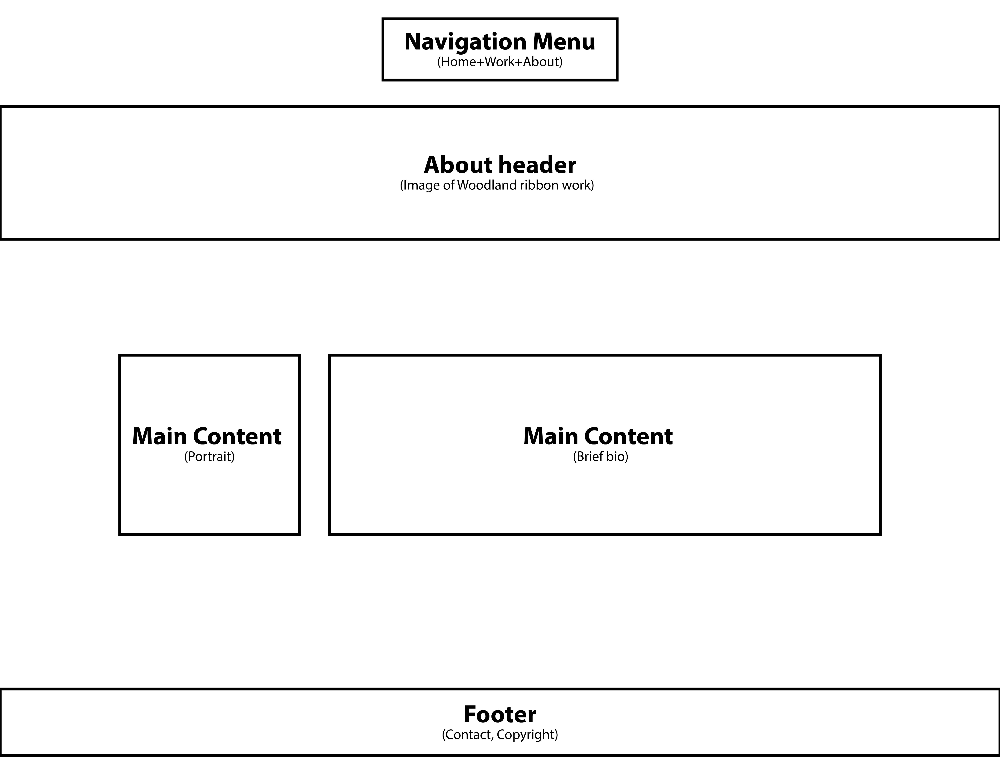

Jennifer Marcussen's INF6420 Project

A portfolio site showcasing my work.

## Wireframes

This is where I will include visual wireframes in order to organize my portfolio site.

Header - will include which page you are vieewing

Navigation Menu - will include links to landing page, work, and about me pages

Main Content - will include logo and a link to enter portfolio

Footer - will include copyright info and contact info

Header - will include which page you are vieewing

Navigation Menu - will include links to landing page, work, and about me pages

Main Content - will include links to portfolio pages for illustration, graphic design, and photography

Footer - will include copyright info and contact info

Header - will include which page you are vieewing

Navigation Menu - will include links to landing page, work, and about me pages

Main Content - will include portrait and brief biography

Footer - will include copyright info and contact info